# 🏰 System Zarządzania Inteligentnym Domem (Smart Home)

Nowoczesna, responsywna aplikacja internetowa klasy premium służąca do monitorowania, sterowania oraz automatyzacji ekosystemu inteligentnego domu. Aplikacja została zaprojektowana z zachowaniem najwyższych standardów estetycznych (stylistyka dark mode, dynamiczne mikro-animacje, szklane tła *glassmorphism* oraz płynne przejścia) i optymalizacji SEO oraz wydajności.

W projekt wbudowano kompleksową analitykę zachowań użytkowników (**Google Analytics 4**) oraz monitoring interakcji i ścieżek użytkowników (**Hotjar / Contentsquare**).

---

## 🛠️ Stos Technologiczny

* **Szkielet Aplikacji**: [React Router v7](https://reactrouter.com/) (z obsługą renderowania po stronie serwera oraz automatycznego odświeżania modułów)
* **Wersja React**: React 19 (z pełnym typowaniem TypeScript)
* **Stylizowanie**: Tailwind CSS v4 (nowoczesna i wydajna architektura CSS)
* **Zarządzanie Stanem i Logika**: React Hooks (State, Effect, Memo, Callback)
* **Uwierzytelnianie**: Firebase Authentication (SDK v12) z wbudowanym mechanizmem automatycznego przejścia na dane demonstracyjne w trybie offline lub przy braku kluczy
* **Analityka i Rejestracja interakcji**: Google Analytics oraz skrypt Contentsquare/Hotjar

---

## 🌟 Główne Funkcjonalności

1. **Autoryzacja**:
   * Logowanie i rejestracja za pomocą adresu e-mail i hasła.
   * Integracja z Firebase oraz elastyczny tryb demonstracyjny (dla szybkich testów interfejsu i doświadczeń użytkownika).
2. **Panel Główny**:
   * Podgląd kluczowych metryk (aktywne urządzenia, temperatura, zużycie energii elektrycznej w czasie rzeczywistym).
   * Interaktywny i dynamiczny wykres zużycia energii elektrycznej z ostatnich 24 godzin.
   * Szybkie akcje do natychmiastowego wyzwalania predefiniowanych stanów domu.
   * Ostatnie aktywności — czytelna oś czasu informująca o zdarzeniach systemowych.
3. **Zarządzanie Urządzeniami**:
   * Wykaz wszystkich urządzeń podzielonych na strefy i pokoje.
   * Kontrola stanu urządzeń (włączanie/wyłączanie, zmiana parametrów jasności lub temperatury).
   * Kreator dodawania nowych urządzeń do sieci domowej.
4. **Automatyzacja i Reguły Logiczne**:
   * Wyzwalanie predefiniowanych scen (np. *Movie Time*, *Good Night*, *Deep Focus*, *Away Mode*).
   * Zaawansowany kreator reguł oparty na strukturze logicznej **IF [Condition] -> THEN [Action]**.
   * Obsługa wielu warunków logicznych (AND/OR), czasu, lokalizacji oraz progów czujników.
5. **Ustawienia**:
   * Konfiguracja profilu domownika, parametrów środowiskowych i strefy czasowej, zarządzania dostępem mieszkańców i gości oraz weryfikacji integralności i wersji systemu.
6. **Katalog Komponentów**:
   * Strona prezentująca wszystkie bazowe klocki interfejsu (przyciski, przełączniki, badge, karty, awatary) używane w systemie.
7. **Powiadomienia**:
   * Otrzymywanie i filtrowanie powiadomień systemowych podzielonych na kategorie takie jak bezpieczeństwo, automatyzacja, stan urządzeń, zużycie energii i komunikaty systemowe.

---

## 📂 Struktura Plików i Moduły

Poniżej znajduje się spis najważniejszych modułów i plików w projekcie z bezpośrednimi odnośnikami:

* **Konfiguracja Aplikacji i Routing**:
  * [app/root.tsx](./app/root.tsx) — Główny szablon aplikacji (układ HTML), w którym zaimplementowano skrypty śledzące **Google Analytics** oraz **Hotjar/Contentsquare**.
  * [app/routes.ts](./app/routes.ts) — Konfiguracja tras w systemie React Router.
  * [app/app.css](./app/app.css) — Globalne arkusze stylów Tailwind CSS v4.
  * [ProtectedRoute.tsx](./app/components/layout/ProtectedRoute.tsx) — Komponent zabezpieczający trasy aplikacji przed nieautoryzowanym dostępem.

* **Autoryzacja**:
  * [Login.tsx](./app/features/auth/components/Login.tsx) — Komponent ekranu logowania i rejestracji.
  * [authService.ts](./app/features/auth/authService.ts) — Obsługa logowania Firebase i generowanie mockowanych użytkowników.
  * [firebaseConfig.ts](./app/features/auth/firebaseConfig.ts) — Inicjalizacja i konfiguracja połączenia z Firebase.

* **Panel Sterowania**:
  * [Dashboard.tsx](./app/features/dashboard/components/Dashboard.tsx) — Główny pulpit z kafelkami statusów, szybkich akcji oraz wykresem energii.

* **Zarządzanie Urządzeniami**:
  * [Devices.tsx](./app/features/devices/components.tsx/Devices.tsx) — Widok listy i statusu urządzeń smart.
  * [AddDevice.tsx](./app/features/addDevice/components/AddDevice.tsx) — Krok po kroku dodawanie nowego urządzenia.

* **Automatyzacja i Sceny**:
  * [Automation.tsx](./app/features/automation/components/Automation.tsx) — Panel automatyzacji i zarządzania scenami.
  * [AddAutomationModal.tsx](./app/features/automation/components/AddAutomationModal.tsx) — Modal z formularzem kreatora nowych reguł logicznych.
  * [LogicRuleRow.tsx](./app/features/automation/components/LogicRuleRow.tsx) — Prezentacja pojedynczej reguły wraz z jej warunkami i akcjami.
  * [SceneCard.tsx](./app/features/automation/components/SceneCard.tsx) — Karta wyzwalania szybkiej sceny środowiskowej.

* **Ustawienia**:
  * [Settings.tsx](./app/features/settings/components/Settings.tsx) — Widok ustawień użytkownika i aplikacji.

* **Dokumentacja Komponentów**:
  * [Showcase.tsx](./app/features/showcase/components/Showcase.tsx) — Klocki UI i przegląd komponentów bazowych.

* **Powiadomienia**:
  * [Notifications.tsx](./app/features/notifications/components/Notifications.tsx) — Panel odbierania, czytania i filtrowania alertów oraz informacji o stanie domu.

---

## 📈 Integracja z Google Analytics & Hotjar

### 1. Google Analytics 4
W pliku [app/root.tsx](./app/root.tsx) zintegrowano kod śledzący z identyfikatorem pomiaru `G-D4Z5W2FK5T`.
Aplikacja wysyła automatyczne zdarzenia takie jak:
* Odsłony stron przy zmianie tras React Router.
* Interakcje użytkownika z przełącznikami urządzeń.
* Rejestracja nowo utworzonych automatyzacji oraz scen.

### 2. Hotjar / Contentsquare
Skrypt zbierający sesje użytkownika w czasie rzeczywistym jest wdrożony bezpośrednio w tagu `<head>` w [app/root.tsx](./app/root.tsx). Narzędzie to odpowiada za:
* Rejestrowanie interakcji i ruchów kursora na pulpicie w celu ulepszania doświadczeń użytkownika.
* Tworzenie map ciepła w celu zbadania, które elementy interfejsu są najczęściej używane przez użytkowników.
* Identyfikację problemów z nawigacją na urządzeniach mobilnych.

---

## 📸 Galeria i Zrzuty Ekranu

### A. Zrzuty Ekranu Aplikacji

#### Widok Logowania
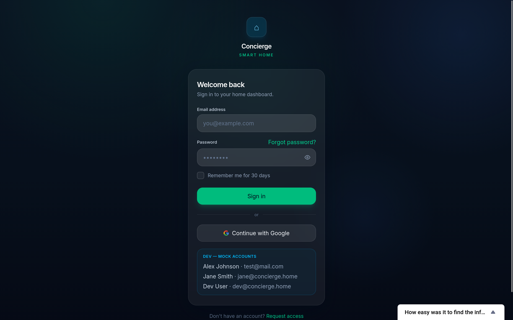

#### Pulpit Główny
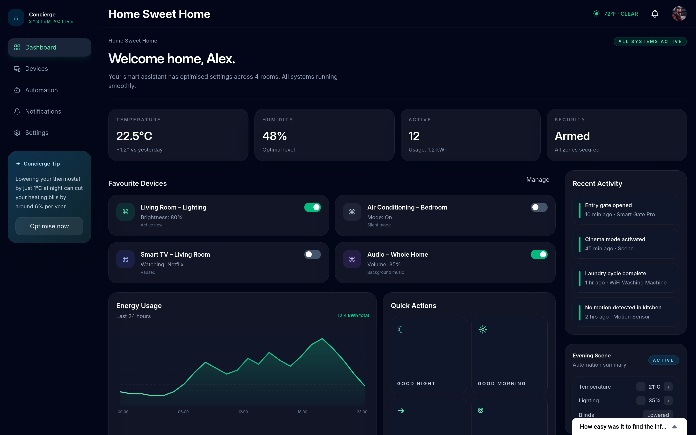

#### Lista Urządzeń
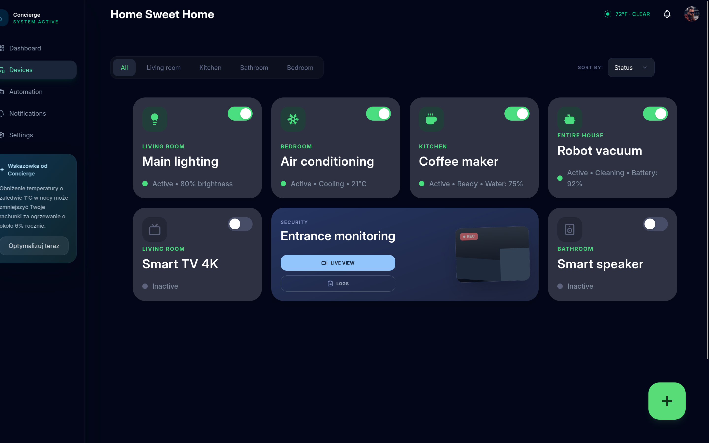

#### Panel Automatyzacji
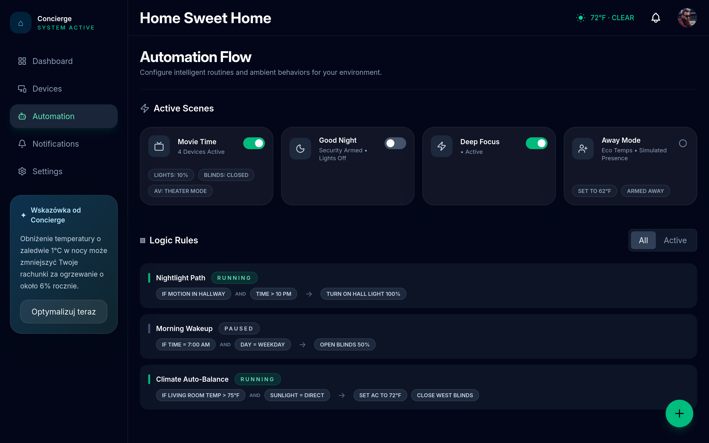

#### Modal Dodawania Reguły
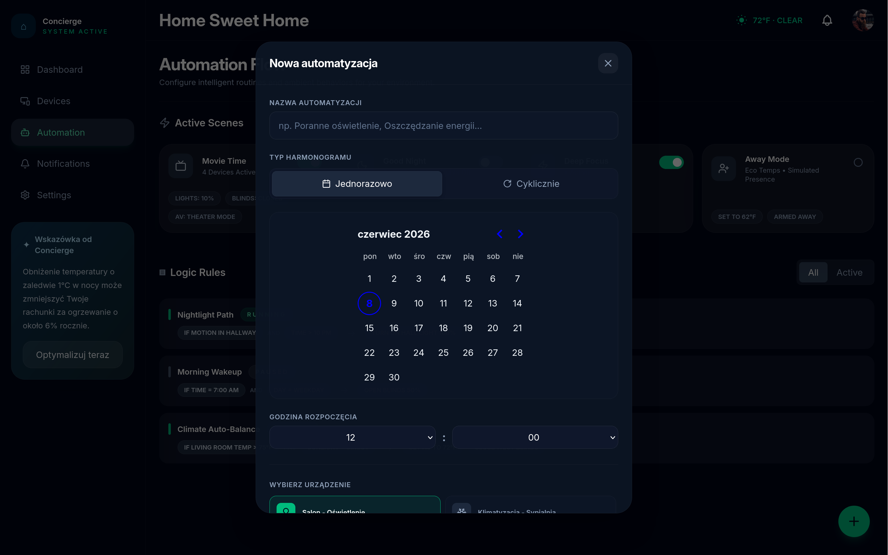

#### Panel powiadomień
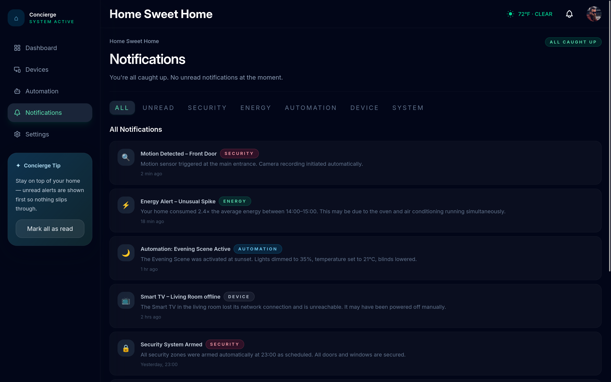

#### Panel ustawień
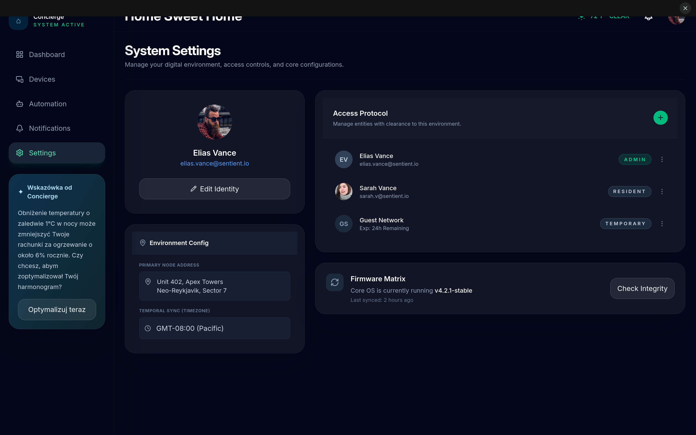

---

### B. Zrzuty Ekranu z Narzędzi Analitycznych

#### Google Analytics 4

* **Panel główny**: Przedstawia ogólne statystyki witryny, w tym liczbę aktywnych użytkowników, ogólną liczbę zdarzeń oraz aktywność użytkowników w czasie rzeczywistym z podziałem na minuty i kraje.
  
  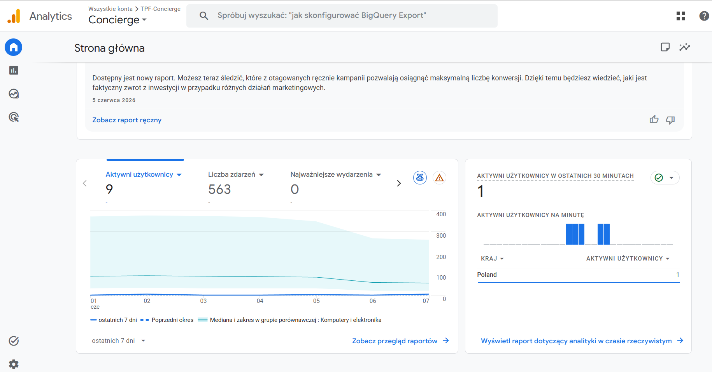

* **Statystyki zdarzeń**: Szczegółowe zestawienie najczęstszych zdarzeń wywoływanych przez użytkowników w aplikacji (takich jak wyświetlenia stron, zaangażowanie oraz przewijanie strony) wraz z wykresami aktywności w czasie.
  
  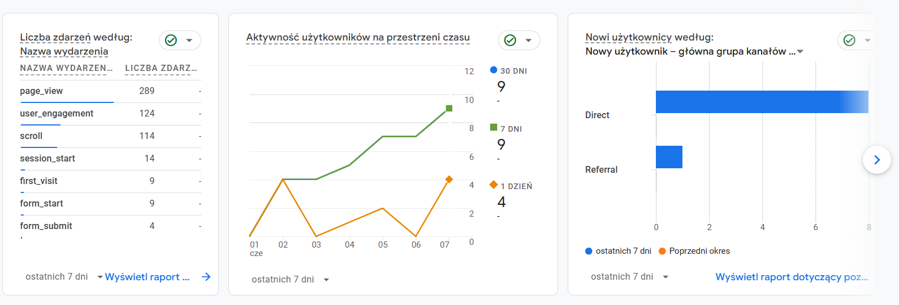

* **Raport geograficzny**: Wykres oraz tabela przedstawiająca liczbę aktywnych i nowych użytkowników w podziale geograficznym, wraz ze współczynnikiem zaangażowania i średnim czasem trwania sesji.
  
  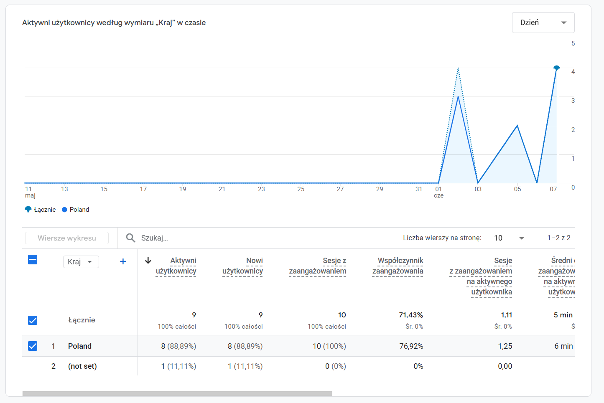

#### Hotjar / Contentsquare
* Dashboard
  
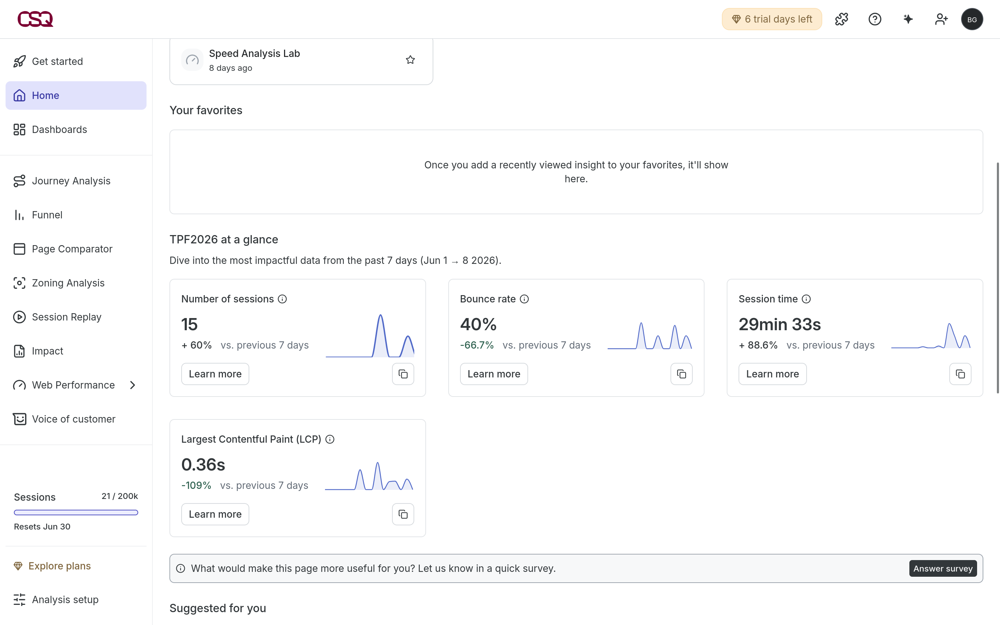

* Session replay:

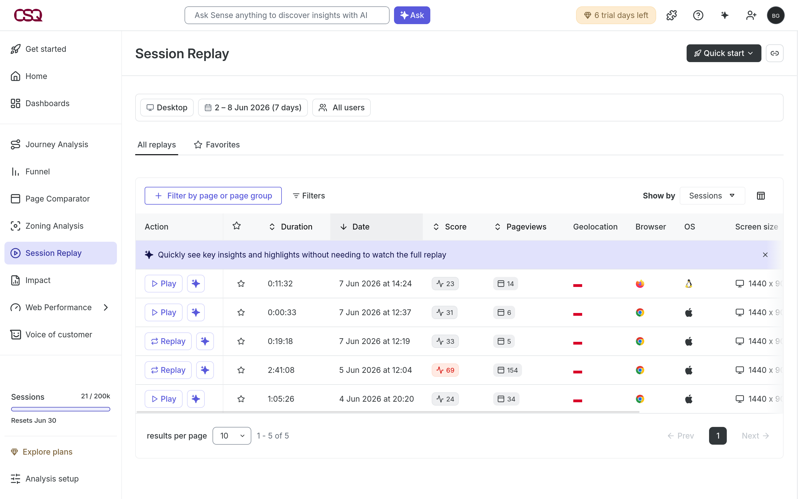

---

## 🚀 Instrukcja Uruchomienia i Wdrożenia

### Wymagania wstępne
* Zainstalowane środowisko **Node.js** (rekomendowana wersja v20 lub nowsza)
* Menedżer pakietów **npm**

### 1. Lokalna instalacja i uruchomienie

Pobierz zależności projektu:
```bash
npm install
```

Uruchom serwer deweloperski z automatycznym odświeżaniem modułów w czasie rzeczywistym:
```bash
npm run dev
```
Aplikacja będzie dostępna pod adresem: `http://localhost:5173`.

### 2. Budowanie produkcyjne

Stwórz zoptymalizowaną wersję produkcyjną:
```bash
npm run build
```

Uruchom lokalnie serwer obsługujący build produkcyjny:
```bash
npm run start
```

### 3. Wdrożenie za pomocą Docker

Aplikacja jest w pełni gotowa do konteneryzacji przy użyciu przygotowanego wieloetapowego pliku [Dockerfile](./Dockerfile).

Zbuduj obraz Docker:
```bash
docker build -t concierge-app .
```

Uruchom kontener na porcie 3000:
```bash
docker run -p 3000:3000 concierge-app
```
Aplikacja zostanie udostępniona pod adresem `http://localhost:3000`.

---

Stworzono przy użyciu React Router.
